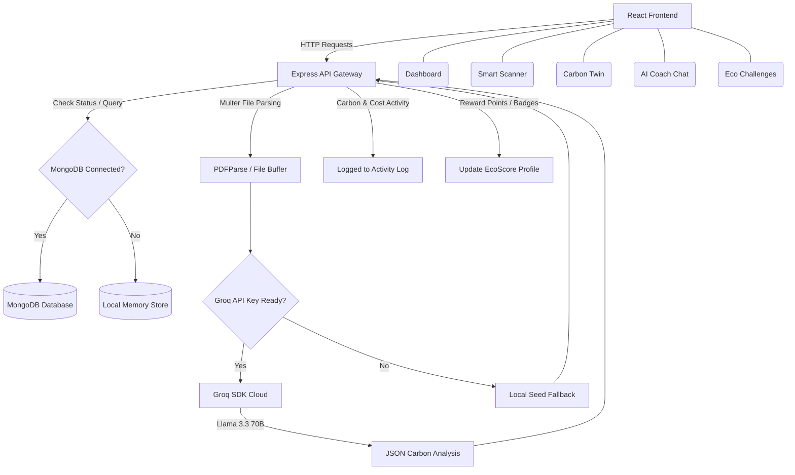

# 🌱 EcoSyn

> AI-Powered Sustainability Workspace & Carbon Twin

EcoSyn is a modern, gamified full-stack platform designed to help citizens and households track, simulate, and reduce their carbon footprint. Utilizing **LLMs (Groq SDK)** and **AI-driven OCR/Vision**, EcoSyn processes utility bills, grocery receipts, and snapshots of household products to calculate carbon footprints, output tailored recommendations, log green activities, and track gamified goals.

---

## 🎯 Core Concept & Hackathon Requirements

### 1. Chosen Vertical
* **Vertical**: **Individual & Household Sustainability / Climate Action Gamification**
* **Target Audience**: Students, households, and individual citizens aiming to track, simulate, and actively mitigate their greenhouse gas emissions through smart visual analysis and behavioral cloning.

### 2. Approach and Logic
* **Digital Clone (Carbon Twin)**: Rather than static tables, the platform builds an adaptive behavioral simulation engine representing the user's ecological clone. Users run "what-if" scenarios (modifying transport distances, diets, thermostat temperatures, and shopping rates) to dynamically see forecasted deviations between a Business-As-Usual (BAU) baseline and Targeted Eco-friendly reductions.
* **Frictionless Onboarding**: Rather than long forms, a 30-second multi-step card/slider wizard initializes profile metrics, seeding initial activities and syncing simulation sliders immediately on signup.
* **AI-First Extraction**: Employs Large Language Models (LLMs) and Vision models to analyze receipt sheets, utility bill PDFs, and product photos to automate carbon estimation, minimizing manual data-entry fatigue.
* **Scoped Multi-Tenancy & Resiliency**: All user metrics, logs, and activity records are scoped to their respective accounts via HMAC-SHA256 authenticated tokens. To handle potential database connection timeouts, the backend features a zero-dependency in-memory cache system that mirrors MongoDB collection behavior, ensuring full platform availability.

### 3. How the Solution Works
1. **Interactive Onboarding**: Upon first login, users complete an interactive card-and-slider wizard to establish their primary travel mode, diet category, monthly electricity units, and shopping frequency. The backend saves initial activity logs and syncs their starting Carbon Twin parameters.
2. **Dynamic Dashboard & Metrics**:
   - `monthlyFootprint` is calculated as the sum of all logged activity carbon footprints.
   - `sustainabilityScore` (0-100) dynamically grades their carbon habits.
   - `savingsCO2` and `savingsCost` track carbon offsets and utility savings from twin simulations and accepted recommendations.
   - Profile levels, points, and badges are recalculated dynamically.
3. **Smart Scanner (OCR & Vision)**: Text parsed from receipts/bills or images of objects are sent to an LLM/Vision model. The model identifies item categories, estimates carbon footprint sizes, and generates actionable, points-rewarding recommendations.
4. **AI Coach Chat**: Reads the user's current profile metrics (footprint, savings, score, level) via prompt injection, providing tailored recommendations.
5. **Real-time Synchronization**: Uses Server-Sent Events (SSE) to push server-side metric changes directly to the browser, updating the sidebar user stats card (including their dynamically assigned adventurer avatar) and charts in real time.

### 4. Key Assumptions Made
* **Emission Coefficients**:
  - Transportation: Car = `0.26 kg CO₂/km`, Motorcycle = `0.18 kg CO₂/km`, Public Transit = `0.08 kg CO₂/km`.
  - Diet: Heavy Meat = `6.2 kg CO₂/meal`, Mixed = `2.5 kg CO₂/meal`, Vegetarian = `0 kg CO₂/meal` (relative baseline).
  - Electricity: `0.45 kg CO₂` per kWh unit.
  - Shopping: `7.2 kg CO₂` per clothing/personal goods item.
* **BAU Growth Rate**: Forecasts assume a standard 10% baseline increase in emissions (Business As Usual factor of `1.1`) over a user's current monthly footprint.
* **Currency / Savings Index**: Financial savings are calculated using standard utility rates (approx. `$0.24` per kWh unit) and fuel indices (`$0.35` per kg CO₂ saved on transport).

---

## ✨ Features Checklist & Highlights

- [x] **Interactive Carbon Twin** – Map monthly carbon footprints, compare forecasts against a Business-As-Usual (BAU) baseline vs. an Eco-friendly track, and monitor lifetime CO2 and financial savings.
- [x] **Smart OCR Scanner (Bills & Receipts)** – Upload utility bills (PDFs) or grocery receipts (images) to automatically parse line items, calculate total carbon/cost, and output a matching recommendation.
- [x] **Smart Vision Assessment** – Upload photos of household appliances, food plates, or vehicles to classify their category, determine carbon intensity rating, and generate green alternatives.
- [x] **Personalized AI Coach** – Interact with **EcoCoach**, a responsive chat interface that analyzes your real-time profile stats (points, level, current score, savings) to provide tailored climate tips.
- [x] **Eco Missions & Leaderboard** – Participate in weekly challenges (e.g., Meatless Mondays, Transit Hero) and check in to level up, earn EcoPoints, unlock special badges, and climb the local standings.
- [x] **Dynamic Activity Log** – Access a complete historical archive of manually logged habits and automated AI scanner entries.
- [x] **Seamless Offline Fallback** – A local, JSON-seeded memory database allows full demo capability even when MongoDB or Groq is offline or unconfigured.

---

## 🏗️ System Architecture

The following diagram illustrates how the frontend components, API endpoints, Mongo database, and Groq LLM layer interact:



---

## 📂 Project Structure

```
EcoSyn/
├── backend/
│   ├── server.js            # Express API server + Mongoose models + Groq endpoints
│   ├── sample-data.json     # Seed data for local memory/fallback execution
│   ├── package.json         # Node scripts & dependencies
│   └── .env.example         # Template for Groq & MongoDB keys
├── frontend/
│   ├── package.json         # Vite + React + Material-UI dependencies
│   └── src/
│       ├── api/
│       │   └── client.js    # Axios client wrapper for backend queries
│       ├── App.jsx          # App navigation layout, sidebar & polling updates
│       ├── App.css          # Shell layout styling
│       ├── index.css        # Base HTML definitions
│       └── components/
│           ├── Dashboard.jsx      # Metrics overview, badge shelf, recent progress
│           ├── SmartScanner.jsx   # OCR Scan / Vision upload fields + AI outputs
│           ├── CarbonTwin.jsx     # Recharts simulation & emission forecasts (BAU vs Eco)
│           ├── AICoach.jsx        # Llama 3.3 interactive coaching chatbot
│           ├── EcoChallenges.jsx  # Active weekly challenges + real-time leaderboard
│           └── ActivityLog.jsx    # Table filter of manual and AI emissions log
└── samples/
    ├── organic_grocery_receipt.png  # Test file for grocery receipt scanning
    └── utility_electric_bill.pdf     # Test file for utility bill OCR parsing
```

---

## 🚀 Setup & Installation

Follow these steps to configure your environment and launch the platform locally:

### 1. Prerequisites
- **Node.js** (v18 or higher recommended)
- **MongoDB** running locally on port `27017` (Optional, as the application falls back automatically to memory storage if MongoDB is unavailable)

### 2. Backend Setup
Navigate to the `backend` directory, install packages, and copy the environment template:
```bash
cd backend
npm install
cp .env.example .env
```
Fill out the keys in your newly created `.env` file:
```env
PORT=5000
MONGO_URI=mongodb://localhost:27017/ecosyn
GROQ_API_KEY=your_groq_api_key_here
```
Run the development server with hot-reloading:
```bash
npm run dev
```
The server will bind to `http://localhost:5000`.

### 3. Frontend Setup
Open a new terminal window, navigate to the `frontend` folder, and start the Vite development server:
```bash
cd frontend
npm install
npm run dev
```
The client dashboard will open at `http://localhost:5173`.

---

## 🔌 API Documentation Reference

| Endpoint | Method | Payload / Form Data | Response | Description |
| :--- | :---: | :--- | :--- | :--- |
| `/api/health` | **GET** | None | `{ status, hasGroqKey, database }` | Checks backend system status, Groq API key registration, and database state. |
| `/api/profile` | **GET** | None | `Profile Object` | Fetches active profile statistics (level, badges, EcoPoints, current emissions, savings). |
| `/api/profile/reset` | **POST** | None | `{ status: "reset", profile }` | Wipes active records and rolls back to standard seed datasets. |
| `/api/activities` | **GET** | None | `Array of Activities` | Retrieves all logged activity records. |
| `/api/activities/log` | **POST** | `{ category, description, amount, carbon, cost, date }` | `{ status, activity, profile }` | Logs a custom sustainability activity and awards `+15 EcoPoints`. |
| `/api/recommendations` | **GET** | None | `Array of Recommendations` | Retrieves active green suggestions. |
| `/api/profile/accept-recommendation` | **POST** | `{ recommendationId }` | `{ status, profile, recommendation }` | Accepts a suggestion, calculates monthly savings, and awards points. |
| `/api/challenges` | **GET** | None | `Array of Challenges` | Fetches active weekly mission checklists. |
| `/api/challenges/complete` | **POST** | `{ challengeId }` | `{ status, challenge, profile, completedNow }` | Progresses a challenge. Incremental progress yields `+5 pts`; completion awards full points + unlocks badges. |
| `/api/leaderboard` | **GET** | None | `Array of Users` | Fetches standard scoreboard, dynamically adjusting the current user's position. |
| `/api/scan` | **POST** | Multipart Form: `file` | `OCR Estimation Result` | Reads PDF/Image receipt to calculate carbon emission outputs and generate action items. |
| `/api/vision` | **POST** | Multipart Form: `file`, `description` | `Vision Assessment Result` | Classifies household items from images and identifies sustainable alternatives. |
| `/api/coach/chat` | **POST** | `{ message, history }` | `{ reply }` | Connects to the LLM coach, injecting profile statistics into the system prompt for customized advice. |

---

## 🧠 Core Prompts (Groq Llama 3.3)

EcoSyn's AI features are powered by targeted prompts designed to output structured responses:

### 1. Smart Receipt & Bill OCR Prompt (`/api/scan`)
> "You are EcoScan AI, an expert carbon footprint estimator. You analyze bills and receipts. Estimate the carbon emissions of the activities in this receipt or bill. Provide: A title, Category, Item details with cost and carbon footprint in kg CO₂, Total cost in dollars, Total carbon footprint, and a personalized recommendation to reduce footprint next time."

### 2. Vision Assessment Prompt (`/api/vision`)
> "You are EcoVision AI, an expert computer vision assistant for carbon footprint assessment. Analyze the user's uploaded image of an object... Provide: Object name, Category, Carbon footprint rating and value, Energy efficiency rating, and 2 sustainable green alternatives with carbon/cost savings."

### 3. Personal AI Coach Prompt (`/api/coach/chat`)
> "You are EcoCoach, a personalized AI sustainability coach... Suggest specific, practical modifications. Keep your response concise and under 150 words. Use user statistics in your replies: Current Footprint, Sustainability Score, EcoPoints, Total Carbon Savings."

---

## 🧪 Demo & Testing Flow

For immediate evaluation, use the sample assets inside the [samples](file:///c:/Users/udayk/OneDrive/Desktop/Hackathons/samples) folder:

1. **Test Receipt Scanning**: Go to **Smart Scanner**, select **Receipt OCR**, and upload `samples/organic_grocery_receipt.png`. The app will parse beef, yogurt, and vegetable items, calculate their carbon emissions, and output a custom food replacement suggestion.
2. **Test Bill OCR parsing**: Upload `samples/utility_electric_bill.pdf` to retrieve power-saving insights.
3. **Accept Recommendations**: Accept any suggested actions from the scan. Check the **Carbon Twin** simulator and the **Dashboard** to see your green line drop below the business-as-usual forecast.
4. **Log Actions & Complete Missions**: Navigate to **Eco Challenges**, click **Check In** on tasks like *Vampire Power Slayer*, earn points, trigger a level-up, and climb the scoreboard.
5. **Ask EcoCoach**: Head to the **AI Coach** and ask how to optimize your utility savings. EcoCoach will reference your active profile stats in its answer.

---

## ☁️ Deployment

### Backend Deployment (e.g. Render / Heroku / Container Services)
1. Set up an Express web service.
2. Provide environment variables: `GROQ_API_KEY` and `MONGO_URI`.
3. Build & start command: `npm install && npm start`.

### Frontend Deployment (e.g. Vercel / Netlify)
1. Connect repository.
2. Configure build settings:
   - Framework preset: `Vite`
   - Build command: `npm run build`
   - Output directory: `dist`
3. Configure environment variable: `VITE_API_URL=https://your-backend-api-url.com`.
